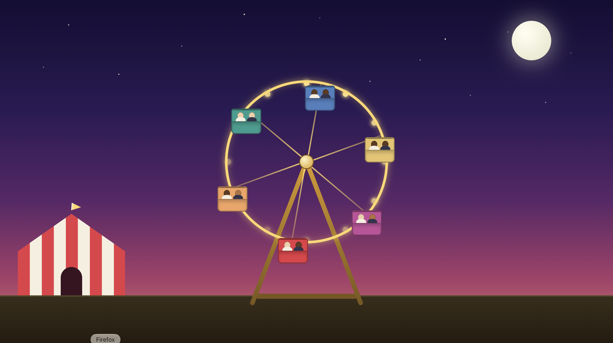

# Carnival Ferris Wheel

An animated carnival scene built with pure HTML and CSS — no JavaScript, no images.
A turning Ferris wheel full of riders sits in a starry dusk sky beside a big-top tent.

**[View the live demo →](https://nirvesh.github.io/ferris-wheel/)**



## About

This started as the freeCodeCamp "Build an Animated Ferris Wheel" project and grew
into a full scene. The wheel rotates while each gondola counter-rotates to stay
upright, so the riders never turn upside down.

## Features

- **Rotating wheel** with six spokes and six gondolas, animated with CSS `@keyframes`.
- **Upright cabins** — each car counter-rotates to keep its riders level.
- **Riders** seated inside the cars, with varied skin tones across the wheel.
- **Carnival backdrop** — gradient dusk sky, twinkling stars, a glowing moon, and
  a striped big-top tent with a fluttering flag.
- **Scaled mount** — the wheel, hub, legs, and base are all sized off one variable,
  so the whole ride stays aligned at any screen size.
- Respects `prefers-reduced-motion` for accessibility.

## Built with

- HTML
- CSS (animations, gradients, `clip-path`, custom properties)

## Running it

Open `index.html` in any modern browser — that's it.

## Structure

```
ferris-wheel/
├── index.html
├── css/
│   └── styles.css
└── ferris-wheel.png
```
